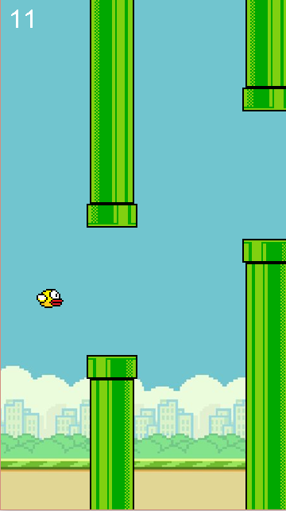
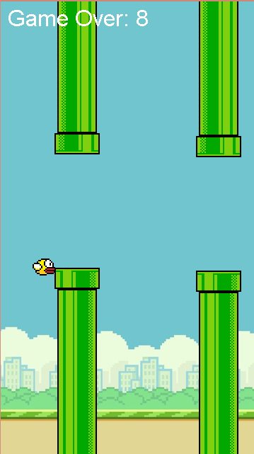

# Flappy Bird Game in Java

Welcome to my Flappy Bird game created using Java! This project is a fun implementation inspired by the classic Flappy Bird game. The goal is to navigate the bird through the gaps in the pipes without colliding.

## 🎮 How to Play
- Press the **spacebar** to make the bird jump.
- Avoid hitting the pipes or the ground.
- The game ends if the bird collides with a pipe or touches the ground.

## 💻 Setup Instructions
1. **Clone the Repository**
   ```bash
   git clone https://github.com/Yashcat2/Fappy-bird.git



